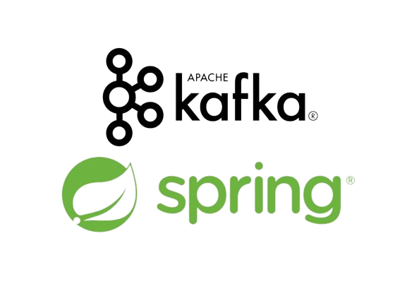

<p align="center">
  
</p>
<h2 align="center">Consumidor de Mensagens Kafka com Spring</h2>
<p align="center">
  
  <a href="https://www.codacy.com/manual/tiquinhonew/kafka?utm_source=github.com&amp;utm_medium=referral&amp;utm_content=tiquinhonew/kafka&amp;utm_campaign=Badge_Grade"></a>
  
  
  
   
</p>
<p align="center">
  <a href="#computer-funcionalidades-principais">Funcionalidades</a>&nbsp;&nbsp;&nbsp;|&nbsp;&nbsp;&nbsp;
  <a href="#checkered_flag-pré-requisitos">Pré-requisitos</a>&nbsp;&nbsp;&nbsp;|&nbsp;&nbsp;&nbsp;
  <a href="#play_or_pause_button-configuração-e-execução">Configuração e Execução</a>&nbsp;&nbsp;&nbsp;|&nbsp;&nbsp;&nbsp;
  <a href="#test_tube-exemplo-de-uso-da-api-de-pagamento">Exemplo</a>&nbsp;&nbsp;&nbsp;|&nbsp;&nbsp;&nbsp;
  <a href="#building_construction-Contribuindo">Contribuindo</a>&nbsp;&nbsp;&nbsp;|&nbsp;&nbsp;&nbsp;
  <a href="#memo-licença">Licença</a>
</p>

Este projeto foi desenvolvido no curso [Aprenda a usar o Apache Kafka em seus serviços
](https://www.udemy.com/course/apache-kafka-valdir/). Seu objetivo é produzir e consumir mensagens no ecosistema Kafka usando Spring Boot. Além disso, o projeto inclui um arquivo Docker Compose para facilitar a configuração e execução da infraestrutura necessária, incluindo Zookeeper, Kafka, Kafdrop e os serviços relacionados.

## :computer: Funcionalidades Principais

- Consumo assíncrono de mensagens Kafka.
- Processamento de mensagens provenientes do tópico Kafka.
- Utilização do Docker Compose para subir toda a infraestrutura necessária.

## :checkered_flag: Pré-requisitos

- Docker
- Docker Compose

## :play_or_pause_button: Configuração e Execução

1. Clone o repositório para o seu ambiente local:

    ```none
    git clone https://github.com/tiquinhonew/kafka
    ```

2. Navegue até o diretório do projeto:

    ```none
    cd nome-do-repositorio
    ```

3. Execute o Docker Compose para iniciar a infraestrutura:

    ```none
    docker-compose up -d
    ```

4. Aguarde até que todos os serviços estejam em execução.

5. Após a execução dos passos acima, o consumidor de mensagens Kafka estará pronto para receber e processar mensagens do tópico.

## :test_tube: Exemplo de Uso da API de Pagamento

Para enviar um pagamento, envie uma solicitação POST para `localhost:8100/payments` com o seguinte corpo JSON:

```json
{
    "id": 12,
    "idUser": 24,
    "idProduct": 42,
    "cardNumber": "999999999"
}
```

---

## :building_construction: Contribuindo

Contribuições são bem-vindas! Se você encontrar algum problema ou tiver sugestões para melhorias, sinta-se à vontade para abrir uma issue ou enviar um pull request.

### :memo: Licença

Este projeto está sob a licença MIT. Veja a [licença](https://github.com/tiquinhonew/kafka/blob/master/LICENSE) para mais informações.
